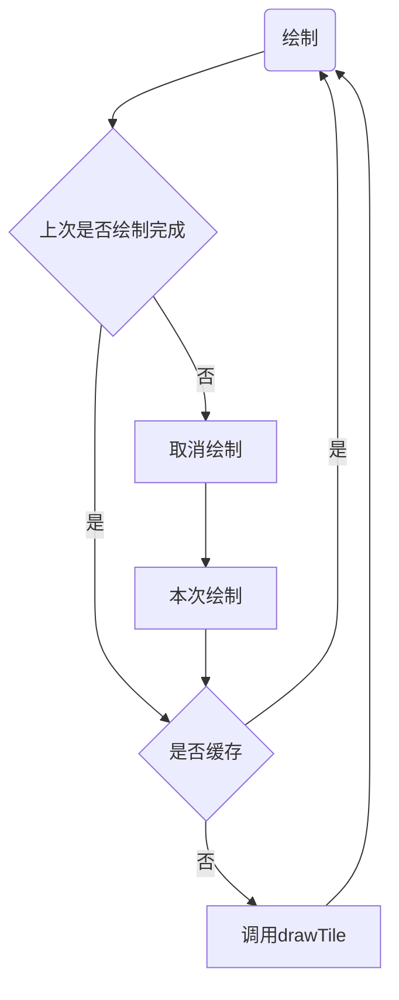

# map-telecom

电信业务相关地图应用

## 快速开始

自行在根目录下创建 index.html 文件

```html

<!doctype html>
<html lang="en">
  <head>
    <meta charset="UTF-8" />
    <link rel="icon" type="image/svg+xml" href="/vite.svg" />
    <meta name="viewport" content="width=device-width, initial-scale=1.0" />
    <script type="text/javascript" src="https://api.map.baidu.com/api?type=webgl&v=1.0&ak="></script>
    <script type="text/javascript" src="https://webapi.amap.com/maps?v=2.0&key="></script>
    <title>MAP+TELECOM</title>
  </head>
  <body>
    <div id="app"></div>
    <script type="module" src="/src/main.ts"></script>
  </body>
</html>

```

安装

```sh

pnpm i

```

启动

```sh

pnpm dev

```

## 地图

### 高德地图

图层

- [ ] 点位
- [ ] 扇区
- [ ] 热力
- [ ] 轮廓
- [ ] 栅格

### 百度地图

图层

- [ ] 点位
- [ ] 扇区
- [ ] 热力
- [ ] 轮廓
- [ ] 栅格

## 渲染流程

1. 请求数据 异步请求数据
   - 分批次异步请求
   - 单次异步请求
2. 数据处理 异步处理数据
   - 异步处理数据
3. 存储到indexedDB
   - 异步存储到indexedDB
4. 渲染到屏幕
   1. 监听是否需要渲染
   2. diff 需要渲染的数据
   3. 计算单个瓦片渲染需要的数据边界
   4. webworker 查询需要渲染的数据
   5. webworker 渲染单个瓦片数据
   6. 回传到主线程合并所有瓦片数据
   7. 渲染到屏幕

## 渲染处理

注意事项

1. 频繁渲染
2. 前渲染覆盖当前渲染

绘制逻辑


